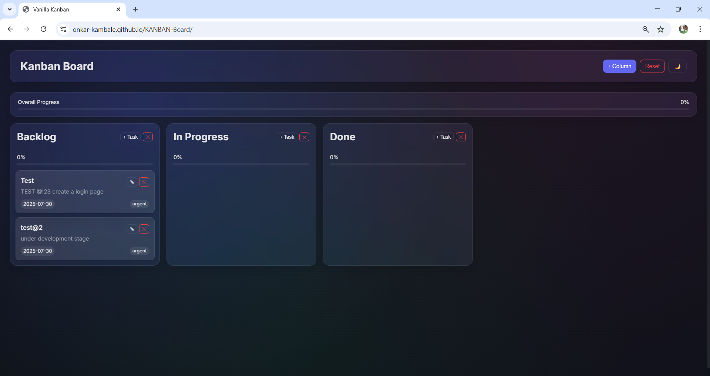
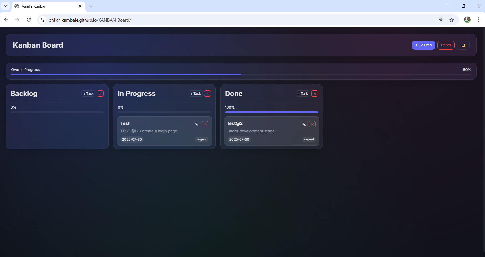
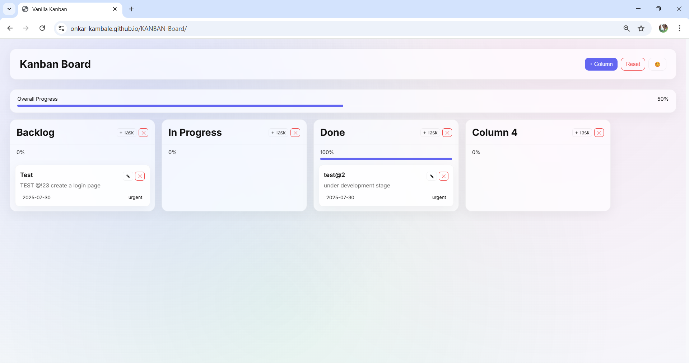
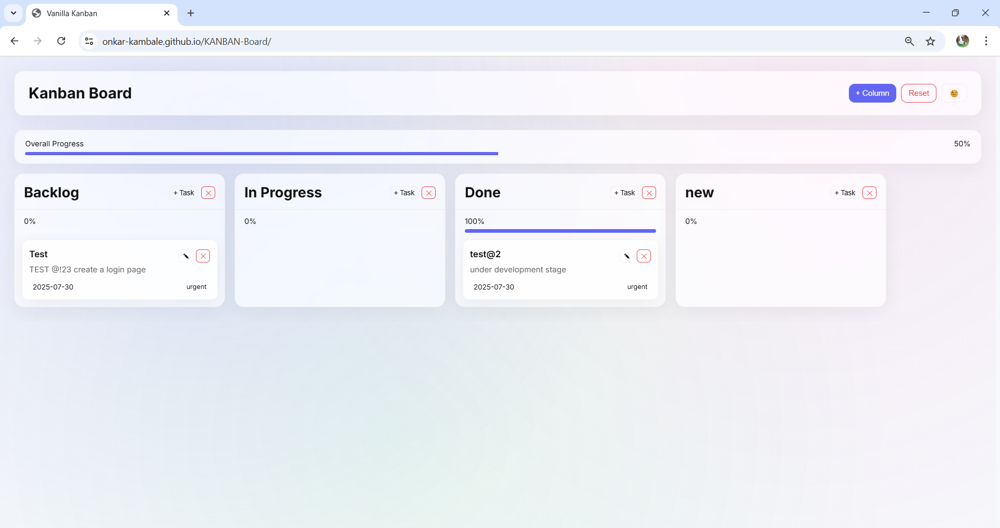

# 🗂️ Vanilla Kanban Board

A fully functional **Kanban board** built with **HTML, CSS, and JavaScript**, featuring:

- **Drag & drop** support for both columns and tasks
- **Progress tracking** with column and overall progress bars
- **Persistent data** storage using `localStorage`
- **Light/Dark theme** toggle
- **Beautiful glassmorphism UI**

---

## 🚀 Demo

https://onkar-kambale.github.io/KANBAN-Board/

---

## 📂 Project Structure

 index.html # Main HTML structure
 
 style.css # Glassmorphism UI styles
 
 script.js # Kanban logic (drag & drop, storage, etc.)
 
 README.md # Documentation

---

## ✨ Features

- **Create, edit, and delete columns** dynamically.
- **Add, edit, and remove tasks** with descriptions, due dates, and tags.
- **Drag and drop tasks** between columns.
- **Reorder columns** by dragging them horizontally.
- **Real-time progress bars** for each column and the overall board.
- **LocalStorage persistence** (your board state is saved automatically).
- **Light/Dark theme switch** (with smooth glassmorphic background).

---

## 🛠️ Technologies Used

- **HTML5** for structure
- **CSS3 (Glassmorphism)** for styling
- **Vanilla JavaScript (ES6)** for interactivity
- **LocalStorage API** for saving data

---

## 📸 Screenshot

---

## 📜 License
This project is open-source and available under the MIT License.

---
